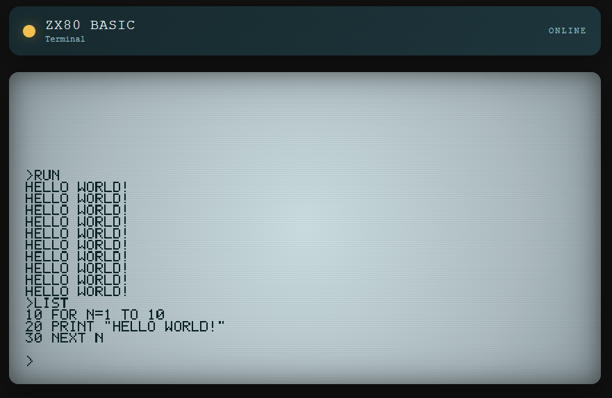

# ZX80 BASIC (ESP32)

This project is a small ZX80-style BASIC interpreter that runs on ESP32 boards
using Arduino + PlatformIO. It is an approximation of the original Sinclair
ZX80 BASIC: the syntax and behavior are similar, but not a full or exact clone.

## BASIC commands supported

Statements (keywords are case-insensitive):

- REM
- PRINT
- LET (also implicit assignment like `A=10` or `A(2)=5`)
- INPUT
- GOTO
- IF ... THEN
- END
- STOP
- RUN [line]
- LIST
- NEW
- CLS
- CONT / CONTINUE
- GOSUB
- RETURN
- FOR ... TO ... [STEP ...]
- NEXT [variable]
- POKE addr, value
- RANDOMISE [seed] / RAND [seed]
- DIM A(n) or DIM A(n,m)
- LOAD 
- SAVE

Functions and expression features:

- Integer arithmetic: `+ - * /`
- Comparisons: `< > = <= >= <>` (result is -1 for true, 0 for false)
- Variables: `A` to `Z` (integer)
- Arrays: `A(i)` or `A(i,j)` after `DIM`
- `RND(expr)` returns 1..expr
- `PEEK(expr)` reads a byte from RAM

## Notes and limitations

- RAM-backed program storage (default 1024 bytes for program + 1024 bytes for
  arrays).
- No string variables; `PRINT` supports string literals in quotes and numeric
  expressions.

## Build and upload

Select the board in `platformio.ini` and use the usual PlatformIO commands:

```sh
pio run -e lolin_s2_mini -t upload
pio device monitor -b 115200
```

Adjust the environment (`lolin_c3_mini`, etc.) as needed.

## Web terminal (ESP32)



The ESP32 now serves an embedded web terminal (CRT-style) over WiFi and
forwards input line-by-line to the BASIC interpreter.

- URL: `http://<esp32-ip>/`
- Endpoint de comandos: `POST http://<esp32-ip>/line`
